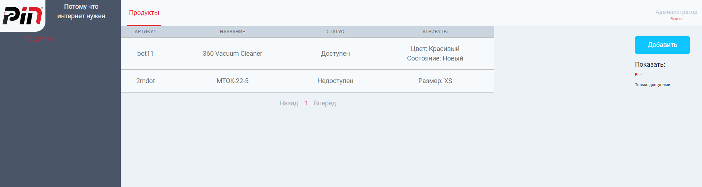

## Global Consulting Test
A test project for Global Consulting Junior PHP developer position.

The main page is a list of all current products. It can be filtered by availability status.
The interface allows to add, edit and delete products. When new product is added, 
notification is sent to the preset email through Laravel Queue.

There is also registration and login pages. New user is registered as a client. Admin role can be set manually
in DB. Only Admin is allowed to edit products articles.

## Stack
Laravel, Inertia.js, Vue.js, PostgreSQL, Docker

## Developing

Install composer
```bash
composer install
```

Install npm dependencies
```bash
npm install
```

Run sail up command
```bash
./vendor/bin/sail up
```

Finally, run npm command
```bash
npm run dev
```

Access the site at <a>http://localhost</a>

## Login data:

For Admin:
<br>
admin@test.ru 
<br>
test

For Client:
<br>
client@test.ru
<br>
test
